# How to refresh token in React Native

## Introduction

While working on a React Native project, I encountered an issue where users were being unintentionally logged out,
causing frustration. The goal was to ensure that users remained logged in without frequent interruptions. Fortunately,
the server provided an API to refresh tokens when authentication expired, allowing us to maintain the user's session
seamlessly.

In this post, I will share how to handle authentication errors in React Native and keep users logged in without frequent
re-authentication.

## What is an Access Token?

HTTP is a stateless protocol, meaning each request is processed independently, with no inherent connection to previous
requests. The server doesn’t automatically know which user is making each request. To verify user identity and ensure
consistent access, additional mechanisms are necessary.

One common method is the OAuth 2.0 protocol, a standard designed to securely authorize access. A widely-used
implementation of OAuth is the Bearer Token system.

A Bearer Token is a credential provided by the server to the client. The client includes this token in the HTTP request
headers to prove they are authenticated. This avoids repeated verification of credentials. The server can determine if
the user is valid by checking the token.

In this post, the Access Token refers to a type of Bearer Token, such as a JSON Web Token (JWT). JWTs consist of three
parts and securely transmit data such as the user's identity and token expiration time. This method is widely used in
mobile projects like React Native.

## What is a Refresh Token?

Access Tokens have a short lifespan for security reasons. Once the token expires, the client can no longer access the
server with it. This is often the cause of frequent logouts. While short token lifetimes enhance security, forcing users
to log in repeatedly is inconvenient. This problem is solved with the introduction of the Refresh Token.

A Refresh Token is a long-lived token that allows the client to obtain a new Access Token when the current one expires.
When the client logs in, the server issues both an Access Token and a Refresh Token. Later, when the Access Token
expires, the Refresh Token is used to request a new Access Token, maintaining an authenticated state without logging
out.

## Let's Explore the Token Refresh Flow

Now, let's examine how the Access Token is refreshed.

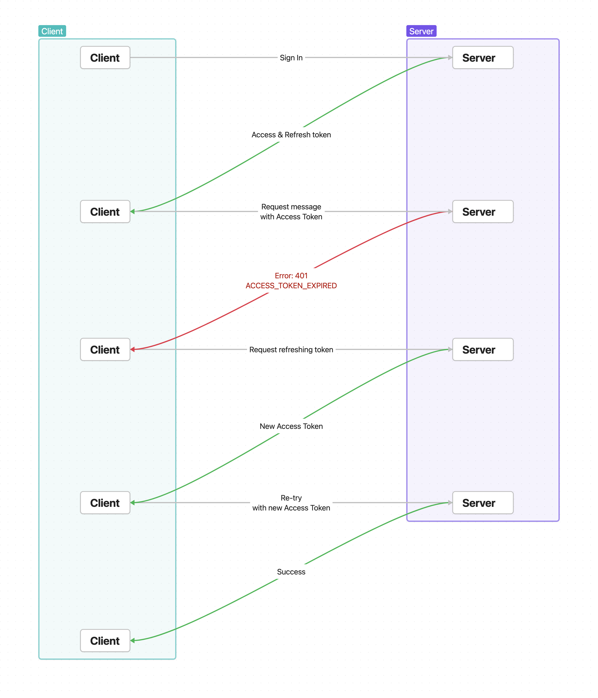

## Practical Implementation of Token Refresh in React Native

In this section, we’ll cover how to implement token refresh in a TypeScript-based React Native project using Axios as
the HTTP client.

### 1. Store Tokens

When a user logs in, the server provides both Access and Refresh Tokens. The client needs to store these tokens securely
on the device for future requests. Typically, `AsyncStorage` is used, but for better security, libraries
like `react-native-keychain` can be used.

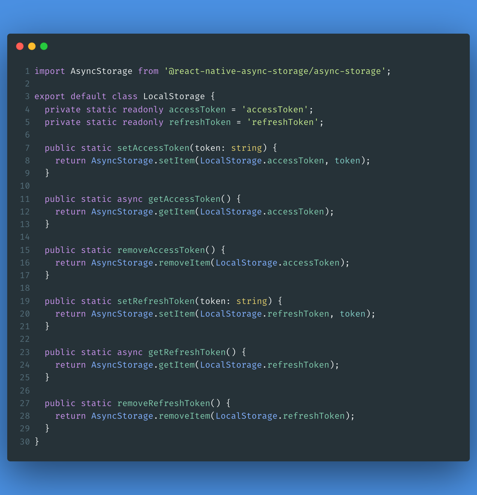

### 2. Attaching the Access Token to HTTP Requests

The `HttpClient` uses Axios for HTTP communication. Axios supports interceptors, which allow you to modify requests
before they are sent. This is where the Access Token is attached to the request headers, ensuring it is sent with each
request that requires authentication.

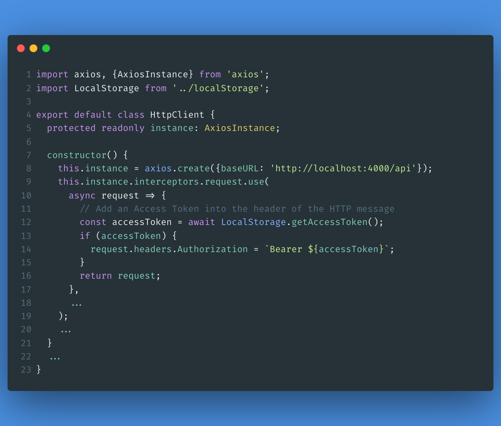

### 3. Handling Errors in HTTP Response

Just as request messages are modified, responses can also be intercepted using Axios response interceptors. When an
error occurs (e.g., an expired Access Token), it is passed to a dedicated error handler like `HttpErrorHandler`. This
centralizes error management, keeping the code clean and maintainable.

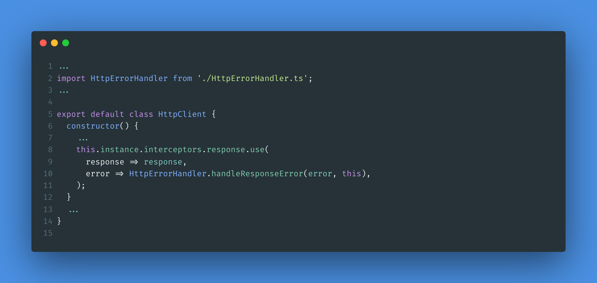
In `HttpErrorHandler`, the first step is to check the error code returned from the server. Based on the code, different
error-handling functions are mapped. If the error code isn’t recognized by the client, the error is thrown out of the
handler for higher-level logic to manage.

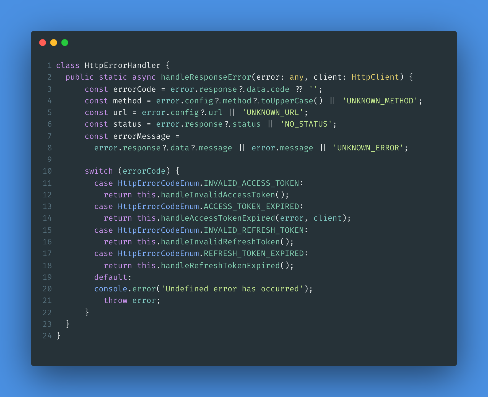

### 4. Handling Access Token Expiration Error

When handling Access Token expiration, it’s essential to differentiate between the first expiration error and subsequent
ones. For the first expiration error, a global flag is set to indicate that the token refresh process is underway. Any
subsequent requests with the same error should be stored in a `pendingRequests` queue.

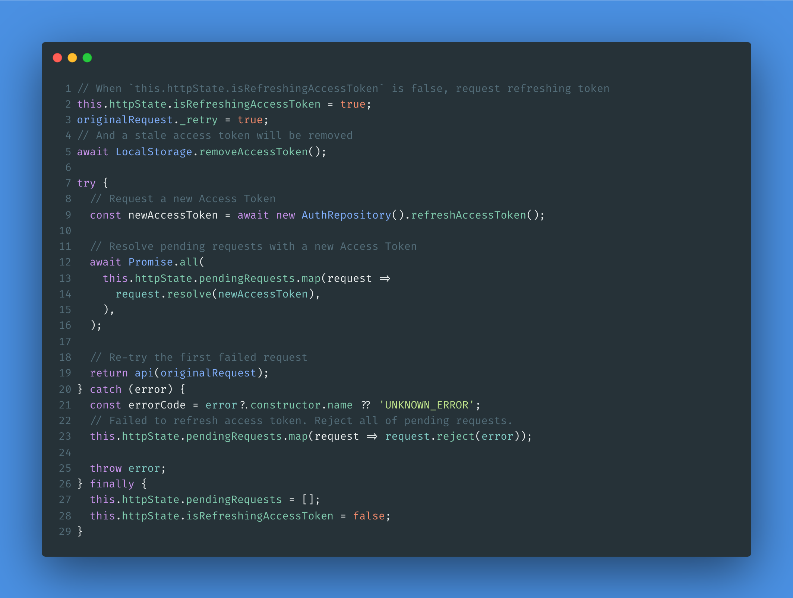

Once the Access Token is successfully refreshed, the pending requests are resolved and retried with the new token. You
won't see the new token explicitly in the retry code, as it gets automatically included in the request headers by the
Axios interceptor, which dynamically attaches the updated Access Token to all outgoing requests.

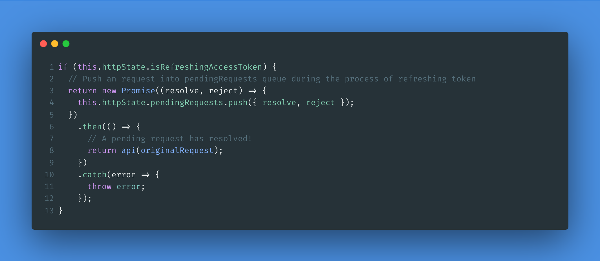

### 5. Handling Other Errors

For errors other than Access Token expiration, perform any necessary processing (e.g., logging or remove a token), then
throw the error out of the `HttpClient`. This allows the error to be handled by higher layers of the application. No
further processing is done inside the `HttpClient`.

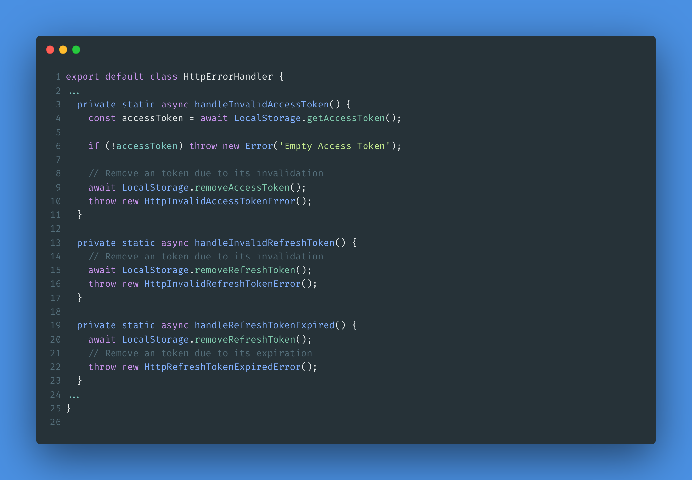

### 6. React Native Error Boundary

Throwing errors from the `HttpClient` allows them to be caught externally in the UI layer. In React Native, you can use
the `ErrorBoundary` component to catch these errors. This component catches any errors during rendering, including
failed HTTP requests, and allows fallback UI to be displayed or errors to be handled gracefully.

By using an `ErrorBoundary`, error handling is separated from the main logic, enabling developers to focus on debugging
and error management. Additionally, it ensures that the app can recover from errors like network failures without
crashing.

At the top of each screen, we will wrap a `Screen` component in an `ErrorBoundary`. This `Screen` component handles any
errors thrown within the screen or its child components. The `ErrorBoundary` can manage specific branching, such as
navigating proper screen, offering retry options, or logging errors for debugging.

By encapsulating each screen in its own `ErrorBoundary`, we ensure that errors are handled independently on each screen
without affecting the entire app. This allows for more granular error management.

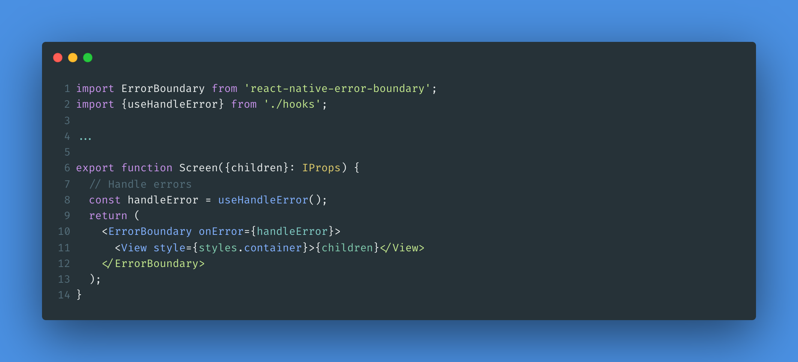
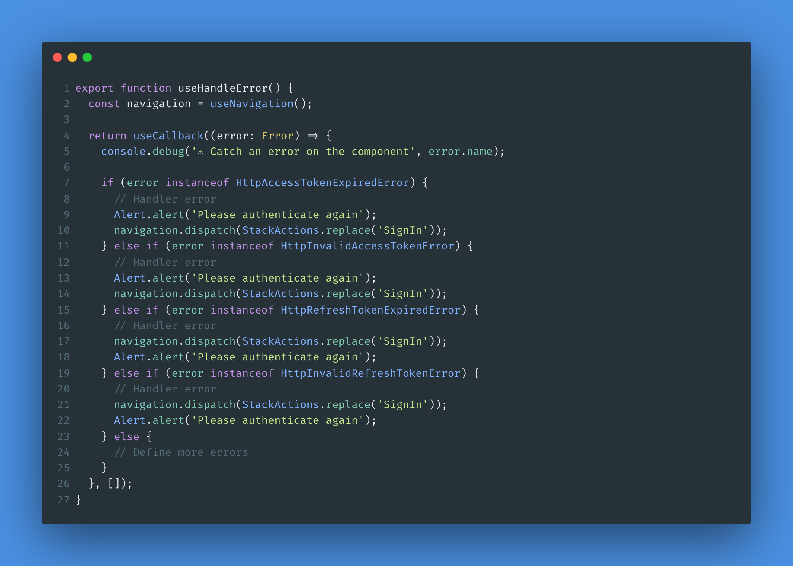

The `Screen` component is then placed at the top of the screen (e.g., `ProtectedScreen`). If a network request error is
thrown from `HttpCilent`, the error is caught by the `ErrorBoundary` instead of the screen itself. This maintains a
seamless user experience while separating concerns, allowing developers to focus on proper error handling and debugging.

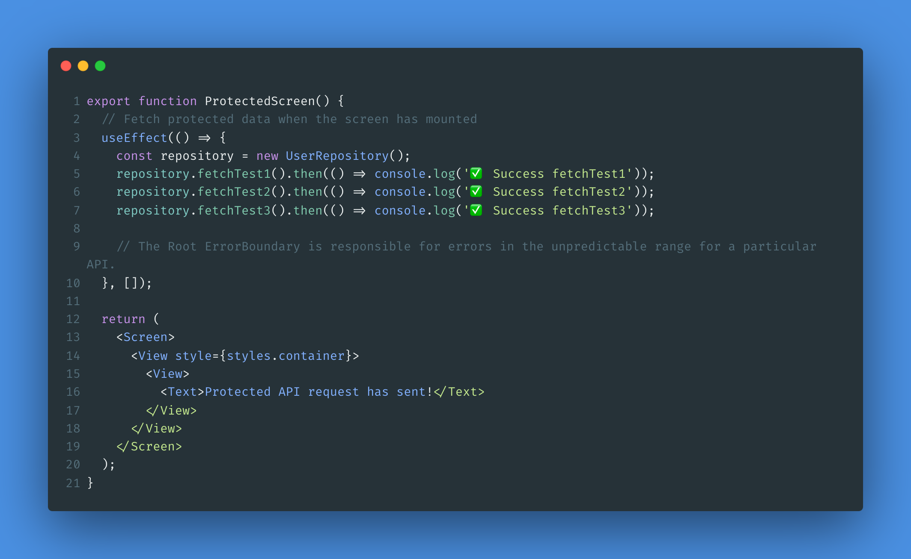

## Conclusion

This approach enables the app to gracefully handle network failures and various types of errors, maintaining a smooth
user experience while ensuring efficient error management.

Feel free to share any further thoughts or feedback in the comments below!
